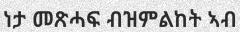
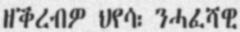
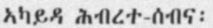
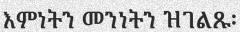
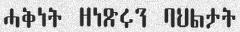

# GLOCR: GeezLab OCR Dataset

## Overview

GLOCR is a Text Recognition (TR) and Optical Character Recognition (OCR) dataset for the Tigrinya language.
The dataset contains a total of 661K image-label pairs from multiple data sources. In addition to the characters-only data, the major part of the dataset is a collection of multi-word text images with labels from three categories: News (from *Haddas Ertra* newspaper), the Bible, and random-trigrams of the 150k most common words in Tigrinya.

### Dataset Summary

- **Total samples**: ~661K image-label pairs
- **Total size**: >1.3GB (tar.gz archives)
- **DOI**: [10.7910/DVN/RQTSD2](https://doi.org/10.7910/DVN/RQTSD2)

### Examples








### Download Dataset

The GLOCR dataset is available on [🤗 Datasets](https://huggingface.co/datasets/fgaim/GLOCR-Tigrinya) hub.

The raw dataset (>1.3GB) is published on [Harvard Dataverse](https://dataverse.harvard.edu/dataset.xhtml?persistentId=doi:10.7910/DVN/RQTSD2) and can be downloaded from there.

### Components

- News text-lines dataset:
  - Subset name: `news`
  - Samples: train (200k), dev (15k), and test (15k)
  - [Download](https://dataverse.harvard.edu/file.xhtml?fileId=4498514&version=1.1)
- Bible text-lines dataset:
  - Subset name: `bible`
  - Samples: train (80k), dev (10k), and test (10k)
  - [Download](https://dataverse.harvard.edu/file.xhtml?fileId=4498513&version=1.1)
- Top 150k text-lines dataset:
  - Subset name: `top150k`
  - Samples: train (150k), dev (15k), and test (15k)
  - [Download](https://dataverse.harvard.edu/file.xhtml?fileId=4498511&version=1.1)
- Characters dataset:
  - Subset name: `characters`
  - Samples: train (120k), dev (15k), and test (15k)
  - [Download](https://dataverse.harvard.edu/file.xhtml?fileId=4498512&version=1.1)
- Unsegmented full-page scanned dataset:
  - Subset name: `unsegmented`
  - Samples: 506 scanned pages with the corresponding text
  - [Download](https://dataverse.harvard.edu/file.xhtml?fileId=4498516&version=1.1)

## Usage of HF Dataset

### Loading a specific subset

```python
from datasets import load_dataset

# Load a specific subset, one of: news, bible, top150k, characters, unsegmented
news = load_dataset("fgaim/GLOCR-Tigrinya", "news")

# Access samples
sample = news["train"][0]
print(sample["text"])
sample["image"].show()
```

### Loading a specific split

```python
# Load a specific split of a subset
bible_test = load_dataset("fgaim/GLOCR-Tigrinya", "bible", split="test")

# Access samples
print(bible_test["text"][0])
bible_test["image"][0].show()
```

### Loading all text-line data combined

```python
# Load all text-line data combined
all_data = load_dataset("fgaim/GLOCR-Tigrinya", "all")

# Access samples
sample = all_data["train"][0]
print(sample["text"])
sample["image"].show()
```

## Cite

If you use this dataset in your product or research, please cite as follows:

```bibtex
@data{gaim-2021-glocr,
  title     = {{GLOCR: GeezLab OCR Dataset}},
  author    = {Fitsum Gaim},
  year      = {2021},
  month     = {April},
  version   = {1.0},
  publisher = {Harvard Dataverse},
  doi       = {10.7910/DVN/RQTSD2},
  url       = {https://doi.org/10.7910/DVN/RQTSD2}
}
```

## License

This work is licensed under a [Creative Commons Attribution-ShareAlike 4.0 International License](https://creativecommons.org/licenses/by-sa/4.0/).

<a rel="license" href="http://creativecommons.org/licenses/by-sa/4.0/"></a>
