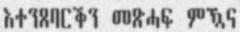

# GLOCR: GeezLab OCR Dataset

A Text Recognition (TR) and Optical Character Recognition (OCR) dataset for the Tigrinya language. 

## Content

The dataset contains a total of 710k image-label pairs from multiple data sources. In addition to the characters-only data, the major part of the dataset is a collection of multi-word text images with labels from three categories: News (from Haddas Ertra newspaper), the Bible, and random-trigrams of the 150k most common words in Tigrinya.

### Examples





### Components:
  * Tigrinya News text-lines dataset. 
    * Samples: train (200k), dev (15k), and test (15k)
    * [Download](https://dataverse.harvard.edu/file.xhtml?fileId=4498514&version=1.1)
  * Tigrinya Bible text-lines dataset.
    * Samples: train (80k), dev (10k), and test (10k)
    * [Download](https://dataverse.harvard.edu/file.xhtml?fileId=4498513&version=1.1)
  * Tigrinya text-lines dataset from top 150k words.
    * Samples: train (150k), dev (15k), and test (15k)
    * [Download](https://dataverse.harvard.edu/file.xhtml?fileId=4498511&version=1.1)
  * Tigrinya Characters dataset.
    * Samples: train (120k), dev (15k), and test (15k)
    * [Download](https://dataverse.harvard.edu/file.xhtml?fileId=4498512&version=1.1)
  * Tigrinya unsegmented full-page dataset.
    * Samples: 506 scanned pages with the corresponding text
    * [Download](https://dataverse.harvard.edu/file.xhtml?fileId=4498516&version=1.1)


## Download

The entire dataset (>1.3GB) is published via Harvard Dataverse and can be downloaded from there: [https://dataverse.harvard.edu/dataset.xhtml?persistentId=doi:10.7910/DVN/RQTSD2](https://dataverse.harvard.edu/dataset.xhtml?persistentId=doi:10.7910/DVN/RQTSD2)


## Cite

If you use this dataset in your product or research, please cite as follows:
```
@data{DVN/RQTSD2_2021,
    author = {Gaim, Fitsum},
    publisher = {Harvard Dataverse},
    title = {{GLOCR: GeezLab OCR Dataset}},
    year = {2021},
    version = {V1},
    doi = {10.7910/DVN/RQTSD2},
    url = {https://doi.org/10.7910/DVN/RQTSD2}
}
```
